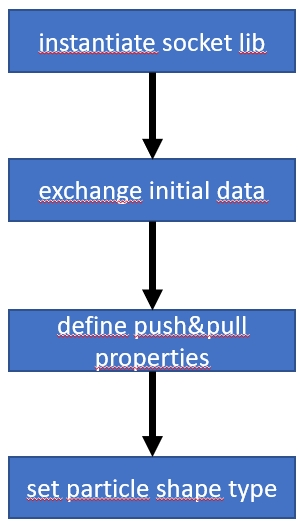
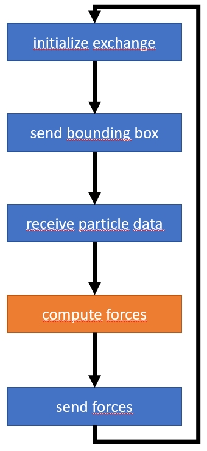

# Ashperix-Palabos coupling

## Preface

This is an illustrative example of how to couple a CFD code to the
Aspherix® simulation engine. The physics depicted in this example are
not correct, however the type and order of the instructions are.

## Prerequisites

To compile and run this example, two more git repositories need to be
cloned.

### Aspherix-CoSim-Socket-Lib

The CoSim socket lib handles the communication with Aspherix®. To
install it, clone [this
repository](https://github.com/CFDEMproject/Aspherix-CoSim-Socket-Lib). Then,
compile and install the content with

    mkdir build && cd build
    cmake -DCMAKE_INSTALL_PREFIX=path/to/install/destination path/to/socketlib/src -DSTATIC_LIBRARY=ON
    make
    make install

### Palabos

Palabos, the **Pa**rallel **La**ttice **Bo**ltzmann **S**olver
([link](https://palabos.unige.ch/)) is a lattice Boltzmann library
developed initially by FlowKit Ltd., and now maintained by the
University of Geneva. Its development is ongoing, and the current
version can be obtained from UNIGE's [gitlab
repository](https://gitlab.com/unigespc/palabos).

We have created a fork of UNIGE's repository, which preserves the
state of Palabos with which the content of this repository was
developed. The repository can be found
[here](https://github.com/CFDEMproject/Palabos-fork). To compile and
run the Aspherix-Palabos coupling, clone our fork instead of the
official Palabos repository.

No further steps are necessary for Palabos, since the case compiles
the necessary Palabos components on-demand.

## Compilation

Make sure that you compiled the Aspherix CoSim library correctly, and
that the Palabos-fork repository is properly cloned. To compile the
case, a few changes to the `Makefile` in this repository are
necessary. The `Makefile` contains several variables to configure the
build process. The following variables need to be adjusted:

* `palabosRoot`: set this to the full absolute or relative path of
  your Palabos download.
* `libraryPath`: set this to the full, absolute path where the
  compiled `libaspherix_cosim_socket.so` is located (usually
  `cosim/install/dir/lib/`)
* `includePath`: set this to the full, absolute path where the file
  `aspherix_cosim_socket.h` is located (usually
  `cosim/install/dir/include/aspherix_cosim_socket/`)

Once these settings are complete, compile the case with

    make

## Execution

To run, the `LD_LIBRARY_PATH` needs to be adjusted to run the case:

    export LD_LIBRARY_PATH=path/to/cosim/lib:$LD_LIBRARY_PATH

where the path is the same as `libraryPath` in the `Makefile`. Once
this is done, just run

    ./Allrun.sh

in the case directory. The script will start Aspherix® with the input
script `in.lbdem` in the background. This input script contains a
`simulate time forever` command, which causes Aspherix® to just keep
simulating as long as there is data exchange through the socket
library. Then, `sedimentingSphere`, the binary created during the
compilation step, is started. This binary sets up the communication
via the socket lib.

## Description of data exchange

All data exchange is done through an instance of
`AspherixCoSimSocket`. In the current example, the calls to this
object are wrapped in the class `AspherixSocketWrapper` (to be found
in `aspherix_socket_wrapper.h`) for clarity. To examine the actual
calls to the `AspherixCoSimSocket` object, examine the implementation
of the wrapper class. "CFD code" or "CFD process" in the following
both refer to the code found in `sedimentingSphere.cpp`.

The setup follows the following scheme:

1. **initialize communication:** The connection is initialized once an
   instance of `AspherixCoSimSocket` is created (in this case in the
   constructor of `AspherixSocketWrapper`). Then, the `initComm()`
   function exchanges some first data: the DEM timestep set in the
   Aspherix® input script is read, then the coupling interval (the
   number of timesteps Aspherix® simulates between data exchanges) is
   written, and finally information on coarsegraining is read.
2. **set push/pull properties:** It is necessary to tell the socket
   library which values are exchanged, and whether these are
   per-particle scalars or per-particle vectors. This is done through
   the `addPushProperty()` and `addPullProperty()` commands, and
   finalized with a call to `createProperties()`.
3. **set particle shape type:** tell Aspherix® which particle shape is
   expected. In the current example, `"sphere"` is used.

During the actual simulation, the following steps are performed
periodically:

1. **begin exchange:** The socket code `start_exchange` is written to
   the socket by the CFD code.
2. **exchange bounding box:** The bounding box of the CFD process is
   written to the socket. Once Aspherix® knows the bounding box, it
   can decide which particles to send to the CFD process. This is not
   very important in the present example, but absolutely necessary for
   larger, parallel calculations where the processor domains between
   CFD and DEM simulation parts differ.
3. **receive data:** The positions and velocities are transferred to
   the CFD code. Examine the methods `receiveData()` and
   `getNextParticleData()` of the wrapper to see how the data is
   transferred and unpacked.
4. **compute forces:** the CFD code is responsible for computing
   forces (and possibly also torques) on the particles. This is done
   in lines 299-309 in `sedimentingSphere.cpp`
5. **send data:** The forces are now sent to the Aspherix®
   process. See `addNextSendParticle()` and `sendData()` of the
   wrapper class to examine how the data is packed and sent.

Once the last step is complete, Aspherix® simulates for a number of
steps, and the next cycle continues.
